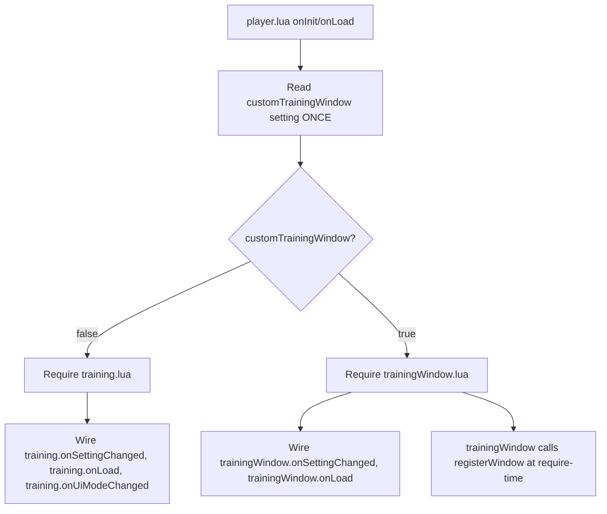
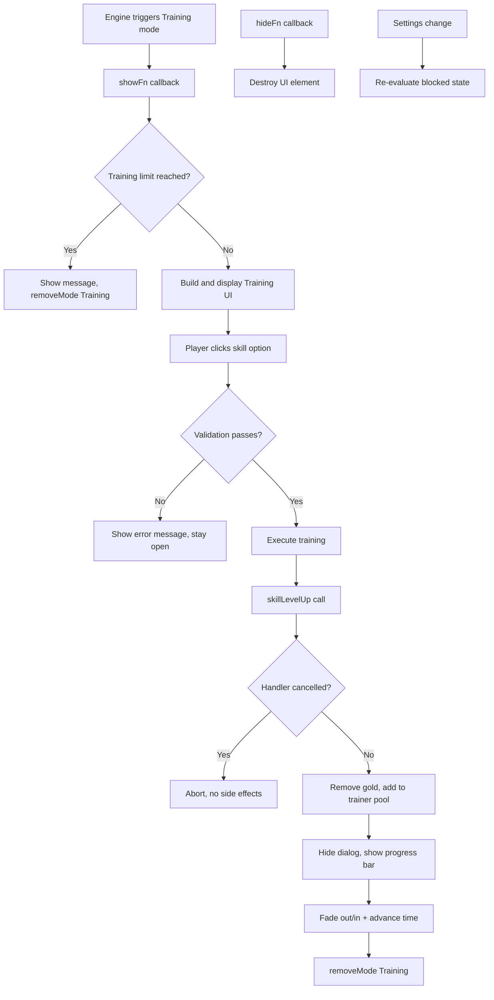
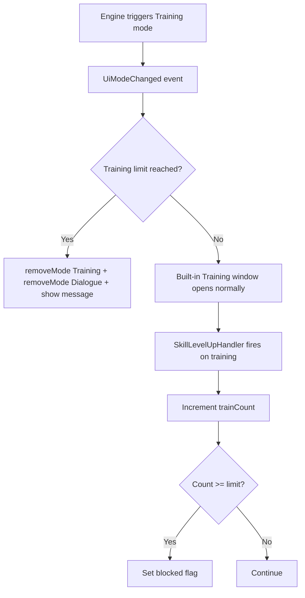

# Design Document: Custom Training Window

## Overview

This feature provides an opt-in custom Training window that replaces the built-in OpenMW Training window with a Lua implementation using `interfaces.UI.registerWindow("Training", showFn, hideFn)`. The custom window replicates all vanilla training behavior (skill selection, price calculation, validation, time advancement) while natively integrating the mod's per-level training limit system. When enabled, this eliminates the current `removeMode("Training")` hack and its one-frame flash artifact.

The feature is **toggleable** via a `customTrainingWindow` boolean setting (default: false). The toggle is evaluated once at player script initialization — mid-session changes have no effect because `registerWindow` permanently disables the built-in Training window and cannot be reverted.

- **Toggle OFF (default)**: The existing `training.lua` module remains active, enforcing limits via `UiModeChanged` + `removeMode("Training")` + `removeMode("Dialogue")`.
- **Toggle ON**: A new `trainingWindow.lua` module registers the custom window and handles all training limit enforcement natively within the window UI.

Both paths share the same `state = { trainCount, trainLevel }` persistence format in `onSave`/`onLoad`, so toggling between sessions preserves training progress.

### Key Design Decisions

- **Two modules, one active**: `training.lua` (existing, default) and `trainingWindow.lua` (new, opt-in) coexist in the codebase. `player.lua` activates exactly one based on the toggle value at init time.
- **Toggle evaluated once**: The `customTrainingWindow` setting is read once during `onInit`/`onLoad`. Changing it mid-session has no effect until the next game restart.
- **Shared persistence format**: Both modules use `{ trainCount, trainLevel }` in the save data, making the toggle reversible across sessions.
- **No external dependencies**: Uses only OpenMW built-in APIs (`openmw.ui`, `openmw.interfaces`, `openmw.types`, `openmw.core`, `openmw.util`).
- **Barter offer reimplemented in Lua**: OpenMW does not expose a `getBarterOffer` Lua function. The vanilla price adjustment formula must be reimplemented using available stat accessors.
- **State machine for time advancement**: Training execution uses a simple state machine (idle → fading → resting → done) driven by `onUpdate` delta time, rather than coroutines or timers.
- **SkillLevelUpHandler lives in the active module only**: Whichever module is active registers the handler. The inactive module does not register a handler, preventing double-counting.

## Architecture

### Toggle Mechanism



### Module Activation Flow

`player.lua` reads the toggle once and conditionally requires the appropriate module:

```lua
local useCustomWindow = settings.get("customTrainingWindow")

local training
if useCustomWindow then
    training = require("scripts.sptLimits.player.trainingWindow")
else
    training = require("scripts.sptLimits.player.training")
end
```

Both modules export the same interface shape, so `player.lua` wires them identically:
- `training.state.trainCount` / `training.state.trainLevel` — read by `onSave`
- `training.onSettingChanged(key, newValue)` — called by settings subscriber
- `training.onLoad(data)` — called by `onLoad` handler

The only difference: `training.lua` also exports `onUiModeChanged(data)` which is wired to the `UiModeChanged` event handler. When `trainingWindow.lua` is active, the `UiModeChanged` handler for training is a no-op (or not wired at all).

### Custom Window Flow (toggle ON)



### Legacy Flow (toggle OFF)



## Components and Interfaces

### training.lua (existing module, UNCHANGED)

**Active when**: `customTrainingWindow = false` (default)

**Responsibilities:**
- Track training count per level via `SkillLevelUpHandler`
- Block training via `UiModeChanged` + `removeMode("Training")` + `removeMode("Dialogue")` when limit reached
- React to settings changes (`trainingLimitEnabled`, `trainingLimit`)
- Reset count on level change

**Exported interface:**
```lua
return {
    state = { trainCount, trainLevel },
    onSettingChanged = function(key, newValue),
    onUiModeChanged = function(data),
    onLoad = function(data),
}
```

### trainingWindow.lua (new module)

**Active when**: `customTrainingWindow = true`

**Responsibilities:**
- Register the custom Training window via `interfaces.UI.registerWindow` at require-time
- Build the UI layout matching vanilla dimensions and skins
- Calculate training prices using the vanilla formula
- Validate training attempts (gold, skill cap, attribute cap)
- Execute training (skill level up, gold transfer, time advancement)
- Track training count per level via `SkillLevelUpHandler`
- React to settings changes (`trainingLimitEnabled`, `trainingLimit`)
- Enforce training limit natively within the window (no removeMode hack)

**Exported interface:**
```lua
return {
    state = { trainCount, trainLevel },
    onSettingChanged = function(key, newValue),
    onLoad = function(data),
}
```

Note: `trainingWindow.lua` does NOT export `onUiModeChanged` — it handles everything via `showFn`/`hideFn` callbacks from the engine.

### Integration with player.lua

`player.lua` conditionally requires one of the two modules based on the toggle:

| Integration Point | training.lua (toggle OFF) | trainingWindow.lua (toggle ON) |
|---|---|---|
| `settings.subscribe` | calls `training.onSettingChanged` | calls `training.onSettingChanged` |
| `onLoad` | calls `training.onLoad(data)` | calls `training.onLoad(data)` |
| `onSave` | reads `training.state.trainCount`, `training.state.trainLevel` | reads `training.state.trainCount`, `training.state.trainLevel` |
| `UiModeChanged` event | calls `training.onUiModeChanged(data)` | no-op (handler not wired or module doesn't export it) |
| `SkillLevelUpHandler` | registered inside `training.lua` at require-time | registered inside `trainingWindow.lua` at require-time |

The variable is named `training` in both cases — `player.lua` doesn't need to know which module is active after initialization.

### settings.lua changes

A new `customTrainingWindow` definition is added to the `sptLimitsTraining` group:

```lua
customTrainingWindow = {
    key = "customTrainingWindow",
    type = "boolean",
    default = false,
    renderer = "checkbox",
    group = "sptLimitsTraining",
    l10nName = "settingCustomTrainingWindowName",
    l10nDesc = "settingCustomTrainingWindowDesc",
    order = 2,
}
```

The description l10n string indicates that enabling requires a game restart.

### OpenMW API Dependencies

| API | Usage |
|-----|-------|
| `interfaces.UI.registerWindow` | Register custom Training window (trainingWindow.lua only) |
| `interfaces.UI.removeMode` | Close Training mode |
| `interfaces.SkillProgression.skillLevelUp` | Trigger skill increase |
| `interfaces.SkillProgression.addSkillLevelUpHandler` | Track training count (in whichever module is active) |
| `interfaces.SkillProgression.SKILL_INCREASE_SOURCES.Trainer` | Source identifier |
| `types.NPC.stats.skills[name](actor)` | Read trainer skill values |
| `types.NPC.stats.skills[name](self)` | Read player skill values |
| `types.Actor.stats.attributes[name](actor)` | Read attribute values |
| `types.Actor.stats.level(self)` | Read player level |
| `types.Actor.inventory(self)` | Access player gold |
| `types.Actor.getBarterGold(actor)` | Read trainer gold pool |
| `types.Actor.setBarterGold(actor, amount)` | Update trainer gold pool |
| `core.getGMST(key)` | Read game settings (iTrainingMod, etc.) |
| `ui.create(layout)` | Create the window UI element |
| `ui.showMessage(text)` | Display feedback messages |

## Data Models

### Module State (shared format between both modules)

```lua
local state = {
    trainCount = 0,
    trainLevel = 0,
}
```

This is the persisted state. Both `training.lua` and `trainingWindow.lua` use this exact structure, so save data is compatible regardless of which module was active when the save was created.

### Window State (local to trainingWindow.lua, not persisted)

```lua
local windowState = {
    element = nil,
    trainer = nil,
    blocked = false,
    advancing = false,
    advanceTimer = 0,
    fadePhase = "none",
}
```

### Skill Option Data (computed on each window open)

```lua
local skillOption = {
    skillId = "longblade",
    name = "Long Blade",
    price = 42,
    affordable = true,
    trainerValue = 67,
}
```

### Price Calculation Model

The vanilla training price formula:

1. `rawPrice = max(1, playerBaseSkill * iTrainingMod)`
2. `finalPrice = max(1, floor(barterOffer(rawPrice, trainer, buying=true)))`

The barter offer adjustment uses the vanilla Morrowind formula based on:
- Player mercantile skill (modified)
- Player personality attribute (modified)
- Player luck attribute (modified)
- Trainer mercantile skill (modified)
- Trainer personality attribute (modified)
- Trainer luck attribute (modified)
- NPC disposition toward player
- Player fatigue term (current/base ratio)
- Trainer fatigue term (current/base ratio)

The formula computes `pcTerm` and `npcTerm` from these values, then:
- `buyTerm = 0.01 * (100 - 0.5 * (pcTerm - npcTerm))`
- `buyTerm = clamp(buyTerm, 0, 1)` per `iBarterSuccessDisposition` logic
- `finalPrice = floor(rawPrice * buyTerm)` (clamped to minimum 1)

### Training Validation Order

1. **Gold check**: `playerGold < price` → ignore click
2. **Trainer skill check**: `trainerSkillValue <= playerBaseSkill` → show `#{sServiceTrainingWords}`
3. **Governing attribute cap**: `playerBaseSkill >= governingAttribute.modified` → show `#{sNotifyMessage17}`

### Time Advancement State Machine

```
idle → training_started → fade_out (0.2s) → fade_delay (0.2s) → fade_in (0.2s) → rest → done
```

During the fade sequence, a progress bar is shown. On completion, `rest(2h, sleeping=false)` is called and the Training mode is removed.

## Toggle Mechanism

### Design Rationale

The toggle exists because `registerWindow` is irreversible within a session — once called, the built-in Training window is permanently disabled. This makes a runtime toggle impossible. Instead:

1. The setting is read **once** at script initialization (`onInit` or `onLoad`).
2. The appropriate module is `require`d based on the value.
3. The module's `SkillLevelUpHandler` is registered at require-time (cannot be unregistered).
4. Mid-session changes to `customTrainingWindow` are ignored — the setting description tells the user a restart is required.

### Persistence Compatibility

Both modules persist and restore the same fields:

```lua
-- onSave (in player.lua)
saved.trainCount = training.state.trainCount
saved.trainLevel = training.state.trainLevel

-- onLoad (in both modules)
state.trainCount = data.trainCount or 0
state.trainLevel = data.trainLevel or types.Actor.stats.level(self).current
```

A player can:
- Save with toggle OFF → load with toggle ON: training count carries over, custom window activates
- Save with toggle ON → load with toggle OFF: training count carries over, removeMode approach activates
- No data migration needed

### What Each Module Owns

| Concern | training.lua (OFF) | trainingWindow.lua (ON) |
|---|---|---|
| SkillLevelUpHandler | ✓ (registered at require) | ✓ (registered at require) |
| Training count tracking | ✓ | ✓ |
| Level reset detection | ✓ (in handler + onUiModeChanged) | ✓ (in handler + showFn) |
| Limit enforcement | removeMode in UiModeChanged | Native in showFn (no window shown) |
| Settings reaction | onSettingChanged updates blocked flag | onSettingChanged updates blocked flag |
| Window registration | ✗ | ✓ (at require-time) |
| UI rendering | ✗ (uses built-in) | ✓ (full custom layout) |

## Correctness Properties

*A property is a characteristic or behavior that should hold true across all valid executions of a system — essentially, a formal statement about what the system should do. Properties serve as the bridge between human-readable specifications and machine-verifiable correctness guarantees.*

### Property 1: Skill selection returns top skills in stable descending order

*For any* set of 27 trainer skill values (0–200 each), the skill selection algorithm SHALL return at most 3 skills with value > 0, sorted in descending order by value, preserving original index order for equal values (stable sort).

**Validates: Requirements 3.1, 3.2, 3.8**

### Property 2: Raw training price calculation

*For any* player base skill value (0–999) and iTrainingMod integer (1–100), the raw training price SHALL equal `max(1, playerBaseSkill * iTrainingMod)`.

**Validates: Requirements 4.1, 4.2**

### Property 3: Barter offer price adjustment

*For any* raw price (1–100000) and valid actor stat combination (mercantile 0–200, personality 0–200, luck 0–200, disposition 0–100, fatigue ratio 0.0–1.0), the barter offer function SHALL produce a final price equal to `max(1, floor(rawPrice * buyTerm))` where buyTerm is computed from the vanilla formula.

**Validates: Requirements 4.3, 4.4**

### Property 4: Affordability determines button skin

*For any* player gold amount (0–1000000) and skill option price (1–100000), the button skin SHALL be "SandTextButton" if gold >= price, and "SandTextButtonDisabled" if gold < price.

**Validates: Requirements 5.1, 5.2**

### Property 5: Validation checks follow strict ordering

*For any* combination of player gold, training price, trainer skill value, player base skill, and governing attribute value, the validation function SHALL return the first failing check in this order: (1) gold insufficient, (2) trainer skill <= player base skill, (3) player base skill >= governing attribute. If none fail, validation passes.

**Validates: Requirements 6.1, 6.2, 6.3, 6.4**

### Property 6: Gold conservation on successful training

*For any* successful training with price P, the player's gold SHALL decrease by exactly P and the trainer's barter gold SHALL increase by exactly P. The sum of player gold and trainer barter gold is invariant across a training transaction.

**Validates: Requirements 7.3**

### Property 7: Blocked state invariant

*For any* combination of trainingLimitEnabled (boolean), trainCount (0–99), and trainingLimit (1–99), the blocked state SHALL equal `(trainingLimitEnabled AND trainCount >= trainingLimit)`. This invariant holds after initialization, after settings changes, and after training sessions. This property applies identically to both `training.lua` and `trainingWindow.lua`.

**Validates: Requirements 9.1, 9.5, 9.6, 14.1**

### Property 8: Training count increments on trainer source

*For any* sequence of skill level-up events, the training count SHALL increment by exactly 1 for each event with source "Trainer", and SHALL not change for events with any other source. This property applies identically to whichever module is active.

**Validates: Requirements 9.7, 14.2**

### Property 9: Level change resets training count

*For any* non-zero training count, when the player's level changes (detected by comparing stored level to current level), the training count SHALL reset to 0 and the blocked state SHALL be re-evaluated against the (now zero) count.

**Validates: Requirements 9.3**

### Property 10: Disabled limit never blocks

*For any* training count value (0–99) and any training limit value (1–99), when trainingLimitEnabled is false, the blocked state SHALL be false and training SHALL proceed without restriction.

**Validates: Requirements 9.8**

## Error Handling

| Scenario | Handling |
|----------|----------|
| `showFn` called with nil actor | Do not create UI, call `removeMode("Training")` |
| `showFn` called while time advancement active | Ignore, do not create new dialog |
| `hideFn` called with no active element | No-op (safe to call multiple times) |
| `hideFn` called during time advancement | Cancel advancement, destroy element, remove mode |
| `skillLevelUp` returns false (cancelled by handler) | Abort training, no gold removed, window stays open |
| Player has 0 gold | All skills shown as disabled, clicks ignored |
| Trainer has 0 skills > 0 | Empty skill list displayed, only OK button active |
| `iTrainingMod` game setting missing | Fall back to default value of 10 |
| Trainer actor becomes invalid mid-session | hideFn will be called by engine on mode removal |
| `customTrainingWindow` changed mid-session | Ignored — active module unchanged until restart |
| Save created with toggle ON, loaded with toggle OFF | trainCount/trainLevel restored normally, removeMode approach activates |
| Save created with toggle OFF, loaded with toggle ON | trainCount/trainLevel restored normally, custom window activates |

## Testing Strategy

### Unit Tests (example-based)

**trainingWindow.lua (custom window path):**
- Window layout construction produces correct widget tree structure
- `showFn` with nil actor does not create element and removes mode
- `showFn` during time advancement is ignored
- `hideFn` is idempotent (safe to call twice)
- OK button click calls `removeMode("Training")`
- Training execution sequence (fade timing, rest call, mode removal)
- Settings change callbacks update blocked state correctly
- `onLoad` restores state from save data
- Tooltip properties are set on all skill option widgets regardless of affordability

**training.lua (legacy path, existing tests):**
- `onUiModeChanged` with blocked=true removes Training and Dialogue modes
- `onUiModeChanged` with blocked=false does nothing
- `onSettingChanged` updates blocked flag correctly
- `onLoad` restores trainCount and trainLevel

**Toggle mechanism (player.lua):**
- Toggle OFF: `training.lua` is required, `UiModeChanged` handler wired
- Toggle ON: `trainingWindow.lua` is required, `UiModeChanged` handler not wired for training
- Toggle read once: changing setting after init has no effect on active module
- Save/load compatibility: data format identical regardless of active module

### Property Tests

Property-based testing library: **busted** with a custom property runner (since this is pure Lua with no package manager, a minimal `forAll` helper that generates random inputs and runs assertions 100+ times).

Each property test runs minimum 100 iterations with randomized inputs:

- **Property 1**: Generate random 27-element skill arrays, verify selection/sorting
- **Property 2**: Generate random (skillLevel, iTrainingMod) pairs, verify raw price
- **Property 3**: Generate random stat tuples, verify barter offer output
- **Property 4**: Generate random (gold, price) pairs, verify skin selection
- **Property 5**: Generate random validation input tuples, verify check ordering
- **Property 6**: Generate random (playerGold, trainerGold, price) tuples, verify conservation
- **Property 7**: Generate random (enabled, count, limit) tuples, verify blocked state
- **Property 8**: Generate random sequences of (source, skillId) events, verify count
- **Property 9**: Generate random (count, oldLevel, newLevel) tuples where oldLevel != newLevel, verify reset
- **Property 10**: Generate random (count, limit) with enabled=false, verify not blocked

Each test is tagged: **Feature: custom-training-window, Property {number}: {title}**

Properties 7, 8, 9, and 10 apply to both modules — the test can be parameterized to run against both `training.lua` and `trainingWindow.lua` implementations since they share the same logic for count tracking and blocked state.

### Integration Tests (manual, in-game)

**Custom window path (toggle ON):**
- Open Training window from dialogue, verify visual match with vanilla
- Train a skill, verify gold deducted and skill increased
- Train until limit reached, verify window blocked on next open
- Level up, verify training available again
- Change settings mid-session, verify immediate effect on limit
- Close window via OK button during normal state
- Interrupt training via engine (e.g., combat) during time advancement

**Legacy path (toggle OFF):**
- Open Training window, verify built-in window appears (not custom)
- Train until limit reached, verify removeMode blocks with one-frame flash
- Level up, verify training available again

**Toggle behavior:**
- Start with toggle OFF, save, change to ON, load — verify custom window activates
- Start with toggle ON, save, change to OFF, load — verify legacy path activates
- Change toggle mid-session — verify no effect until restart
