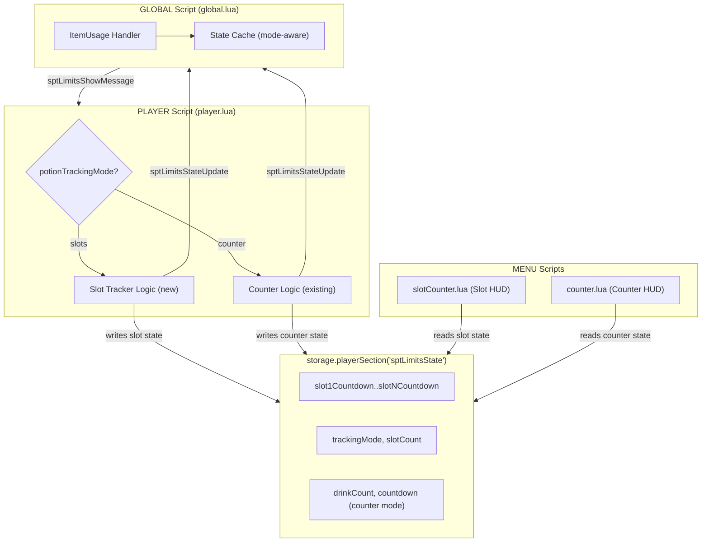

# Design Document

## Overview

This feature adds an alternative potion tracking mode ("slots") to the existing SPT Limits mod. Instead of a single counter with a global cooldown timer, the slot mode tracks each potion drink individually in a fixed-size array of slots. Each slot has its own countdown based on the potion's longest effect duration and frees itself independently when the potion expires.

The two modes ("counter" and "slots") are mutually exclusive, selectable via a `potionTrackingMode` setting. The existing counter mode remains the default and is completely unchanged. The slot mode introduces:

- A configurable number of normal slots (default 4) plus one overflow slot
- Per-slot countdown based on longest effect duration
- Overdose triggered by the overflow slot (hotkey bypass only)
- A vertical HUD layout showing individual slot countdowns
- No global cooldown timer — availability is determined solely by slot occupancy

**Key design decisions:**
- The Slot_Tracker logic lives inside `player.lua` alongside the existing counter logic, gated by the mode setting
- The Slot_HUD is a new MENU script (`slotCounter.lua`) registered alongside the existing `counter.lua`
- Both HUD scripts read `potionTrackingMode` from storage and only one activates
- The global script gains awareness of the mode to switch between `drinkOverdose` and `allNormalSlotsFull` blocking logic

## Architecture



**Communication flow:**
1. Player script writes per-slot or per-counter state to `storage.playerSection("sptLimitsState")`
2. MENU scripts read from the same storage section to render HUD elements
3. Player script sends `sptLimitsStateUpdate` events to the global script for ItemUsage blocking
4. Global script caches mode + blocking state and uses it in ItemUsage handlers

## Components and Interfaces

### Modified: `config.lua`

New default values:

| Key | Type | Default | Description |
|-----|------|---------|-------------|
| `potionTrackingMode` | string | `"counter"` | Active tracking mode |
| `potionSlotCount` | number | `4` | Number of normal slots (1–10) |

### Modified: `settings.lua`

New setting definitions in the `sptLimitsPotions` group:

- `potionTrackingMode` — select renderer with options `"counter"` / `"slots"`, order 1 (shifts existing items down)
- `potionSlotCount` — number renderer, min 1, max 10, order 2 (visible/relevant only in slots mode, but always registered)

The `potionCooldown` setting remains registered (used only in counter mode).

### Modified: `player.lua`

New internal module: **Slot Tracker** — a set of local functions and state variables gated by `potionTrackingMode == "slots"`:

- `initSlots()` — creates the slot array with `potionSlotCount + 1` empty entries
- `assignDrinkToSlot(activeSpellId, longestDuration)` — finds first empty normal slot, assigns drink
- `assignDrinkToOverflow(activeSpellId, longestDuration)` — assigns to overflow slot, triggers overdose
- `tickSlots(dt)` — decrements each occupied slot's countdown by dt, marks expired slots empty
- `validateSlots(activeSpells)` — checks each occupied slot's activeSpellId still exists in active spells; clears if gone
- `getOccupiedNormalCount()` — returns count of occupied normal slots
- `isOverflowOccupied()` — returns whether overflow slot is occupied
- `writeSlotStorage()` — writes per-slot countdowns, occupiedSlots, overflowOccupied, slotCount, trackingMode to storage
- `handleOverflowRecovery()` — restores fatigue when overflow slot empties

The existing counter logic (`updatePotionTimer`, `handleDrinkDetected`, counter storage writes) is wrapped in a `potionTrackingMode == "counter"` guard.

**Mode switch handling:** When `potionTrackingMode` changes via settings subscription:
- "counter" → "slots": call `initSlots()`, stop counter logic
- "slots" → "counter": discard slot state, reset counter state to 0

**Save/Load:** The `onSave` handler includes slot data when mode is "slots". The `onLoad` handler restores slots, validates against active spells, pads/truncates to current `potionSlotCount + 1`.

### Modified: `global.lua`

Extended state cache:

```lua
local playerState = {
    knockedOut = false,
    drinkOverdose = false,        -- used in counter mode
    allNormalSlotsFull = false,    -- used in slots mode
    potionTrackingMode = "counter",
}
```

ItemUsage handler logic change:
- When `potionTrackingMode == "counter"`: existing `drinkOverdose` check (unchanged)
- When `potionTrackingMode == "slots"`: check `allNormalSlotsFull` to block, check `knockedOut` for overdose message

### New: `slotCounter.lua` (MENU script)

A new MENU script that renders per-slot HUD elements. Registered in `.omwscripts` as:
```
MENU: scripts/sptLimits/slotCounter.lua
```

Behavior:
- On each frame, reads `trackingMode`, `slotCount`, per-slot countdowns, and `overflowOccupied` from `storage.playerSection("sptLimitsState")`
- If `trackingMode ~= "slots"` or `hudCounterEnabled == false`: hides all elements
- Creates `slotCount + 1` text elements at initialization, positioned vertically from bottom-right
- Slot 1 uses the same position as the existing counter element
- Each subsequent slot is offset upward by a fixed vertical spacing
- Occupied slots show `"12.3s"` format; empty slots are hidden
- Overflow slot uses a distinct color (red) to indicate overdose state

### Modified: `counter.lua` (MENU script)

Add a mode check: if `trackingMode` from storage is `"slots"`, hide the counter element and skip updates.

### Modified: `SPT Limits.omwscripts`

Add the new MENU script registration:
```
PLAYER: scripts/sptLimits/player.lua
MENU: scripts/sptLimits/counter.lua
MENU: scripts/sptLimits/slotCounter.lua
GLOBAL: scripts/sptLimits/global.lua
```

### Modified: `l10n/sptLimits/en.yaml`

New keys:
```yaml
settingPotionTrackingModeName: "Tracking Mode"
settingPotionTrackingModeDesc: "Counter: single shared cooldown. Slots: individual per-potion tracking."
settingPotionSlotCountName: "Potion Slots"
settingPotionSlotCountDesc: "Number of potion slots available (slot mode only)."
```

## Data Models

### Slot Array (player.lua internal state)

```lua
-- state.slots: array indexed 1 to potionSlotCount + 1
-- Each entry:
{
    activeSpellId = nil,  -- string or nil
    countdown = 0,        -- float, seconds remaining
}
-- Index potionSlotCount + 1 is the overflow slot
```

### Storage Schema (`storage.playerSection("sptLimitsState")`)

Shared keys (always written):
| Key | Type | Description |
|-----|------|-------------|
| `trackingMode` | string | `"counter"` or `"slots"` |

Counter-mode keys (written only when mode is "counter"):
| Key | Type | Description |
|-----|------|-------------|
| `drinkCount` | integer | Current drinks in window |
| `countdown` | float | Seconds until counter resets |
| `potionLimit` | integer | Current max potions setting |

Slot-mode keys (written only when mode is "slots"):
| Key | Type | Description |
|-----|------|-------------|
| `slotCount` | integer | Configured `potionSlotCount` value |
| `slot1Countdown` | float | Slot 1 remaining seconds (0 = empty) |
| `slot2Countdown` | float | Slot 2 remaining seconds |
| ... | ... | ... |
| `slot{N+1}Countdown` | float | Overflow slot remaining seconds |
| `occupiedSlots` | integer | Count of occupied normal slots (0–N) |
| `overflowOccupied` | boolean | Whether overflow slot is occupied |

### Save Data Schema (onSave return value)

When `potionTrackingMode == "slots"`:
```lua
{
    knockedOut = boolean,
    overdoseCollapse = boolean,
    trainCount = number,
    trainLevel = number,
    settings = { ... },  -- all settings via settings.saveAll()
    slots = {
        -- array indexed 1 to potionSlotCount + 1
        { activeSpellId = string|nil, countdown = number },
        ...
    },
}
```

When `potionTrackingMode == "counter"` (unchanged from current):
```lua
{
    knockedOut = boolean,
    drinkCount = number,
    timer = number,
    drinkHour = number,
    overdoseCollapse = boolean,
    trainCount = number,
    trainLevel = number,
    settings = { ... },
}
```

### Event Payload: `sptLimitsStateUpdate`

Extended payload (player → global):
```lua
{
    knockedOut = boolean,
    drinkOverdose = boolean,           -- counter mode only
    allNormalSlotsFull = boolean,       -- slots mode only
    potionTrackingMode = "counter"|"slots",
}
```

### Settings Definitions (new entries)

```lua
potionTrackingMode = {
    key = "potionTrackingMode",
    type = "string",
    default = config.potionTrackingMode,
    renderer = "select",
    options = { "counter", "slots" },
    group = "sptLimitsPotions",
    l10nName = "settingPotionTrackingModeName",
    l10nDesc = "settingPotionTrackingModeDesc",
    order = 1,
}
potionSlotCount = {
    key = "potionSlotCount",
    type = "number",
    default = config.potionSlotCount,
    min = 1,
    max = 10,
    renderer = "number",
    group = "sptLimitsPotions",
    l10nName = "settingPotionSlotCountName",
    l10nDesc = "settingPotionSlotCountDesc",
    order = 2,
}
```


## Invariants

The following invariants describe the expected behavior of the system. They serve as a reference for manual verification and code review.

- **Mode Exclusivity** — In "slots" mode, counter state (drinkCount, timer, drinkHour) remains at initial values. In "counter" mode, the slot array remains empty.
- **Mode Switch Resets** — Switching modes always produces a clean initial state for the newly active subsystem.
- **Slot Array Size** — The slot array always has exactly `potionSlotCount + 1` entries, with overflow at the last index.
- **Save/Load Round-Trip** — Serializing and deserializing (with all activeSpellIds still active) produces an identical slot array.
- **Load Normalizes Size** — Loading pads or truncates the persisted array to match the current `potionSlotCount + 1`.
- **Lowest-Index Assignment** — New drinks always occupy the lowest-index empty normal slot.
- **Excluded Potions Bypass** — Excluded potions never modify slot state.
- **Overflow Assignment** — When all normal slots are full, the next drink goes to overflow. If overflow is also occupied, the drink is ignored.
- **Countdown Tick** — Each occupied slot decrements independently by dt per frame; reaching 0 clears the slot.
- **Positional Stability** — Slots never shift indices when other slots expire.
- **Instant-Effect Occupancy** — Potions with duration 0 occupy a slot (countdown 0) until their activeSpellId disappears.
- **Load Validates ActiveSpellIds** — On load, slots whose activeSpellId is no longer active are cleared.
- **Storage Reflects State** — Storage keys always mirror the current slot array state after writes.
- **HUD Formatting** — Countdown display uses `"%.1fs"` format (e.g. "12.3s").

## Error Handling

### Invalid Settings Values

- If `potionTrackingMode` is set to an unrecognized value (neither "counter" nor "slots"), treat it as "counter" (the default). The settings system's select renderer prevents this in normal use, but defensive handling protects against corrupted save data.
- If `potionSlotCount` is outside [1, 10], clamp to the nearest bound (same pattern as existing settings via min/max enforcement in `settings.get`).

### Corrupted Save Data

- If `data.slots` is nil or not a table when loading in slots mode, initialize all slots to empty (same as new game).
- If a slot entry in the persisted array is malformed (missing fields), treat it as empty.
- If a persisted activeSpellId is not a string, treat the slot as empty.
- If a persisted countdown is negative or not a number, clamp to 0.

### ActiveSpell Disappearance

- If an activeSpellId disappears between frames (potion dispelled, cured, or expired), the slot is cleared immediately. No error — this is normal gameplay.
- The `pcall` wrapper around `types.Potion.record(spell.id)` continues to protect against invalid record lookups (same pattern as existing code).

### Mode Switch During Overdose

- If the player switches from "slots" to "counter" while in overdose (overflow occupied, knocked out), the mode switch resets all state including knockedOut. The player recovers immediately. This is acceptable — changing settings mid-collapse is an explicit player action.

### Storage Read Failures

- The Slot_HUD treats nil values from storage as "slot empty" (element hidden). No error state needed.
- The Counter_HUD already handles nil values gracefully (existing behavior).


